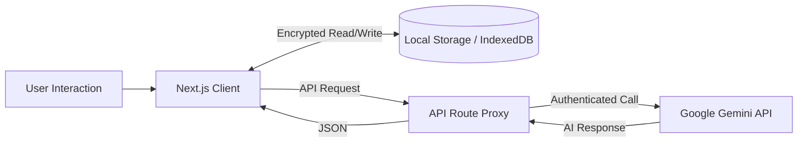

<div align="center">

# ✨ AI-Powered Resume Builder

### The Modern, Privacy-First Resume Creation Platform

<div align="center">
  
  
  
  
  
</div>

<div align="center">
  <br />
  
  
  
</div>

<br />

<p align="center">
  <a href="#features">Features</a> •
  <a href="#tech-stack">Tech Stack</a> •
  <a href="#getting-started">Getting Started</a> •
  <a href="#architecture">Architecture</a> •
  <a href="#security--privacy">Security</a>
</p>

</div>

---

## 🚀 Project Overview

**AI-Powered Resume Builder** is a production-grade, open-source application designed to revolutionize how professionals create and optimize their resumes. By leveraging the advanced capabilities of **Google Gemini AI**, this platform offers real-time content analysis, intelligent rewriting, and ATS (Applicant Tracking System) optimization—all while maintaining complete user privacy through a **local-first architecture**.

Unlike traditional resume builders that store data on remote servers, this application runs entirely in your browser, securing your personal information with industry-standard encryption locally on your device.

### Core Value Proposition

*   **🛡️ Privacy First:** Your data never leaves your device unless you explicitly interact with the AI.
*   **🤖 AI-Native:** Built from the ground up with Generative AI to act as your personal career coach.
*   **⚡ Modern UX:** A premium, fluid interface built with the latest web technologies.

---

## ✨ Features

### 🧠 Advanced AI Capabilities
*   **Smart Summarization:** Instantly generate professional summaries based on your experience.
*   **Content Rewriting:** Transform bullet points with professional, concise, or detailed tones.
*   **Deep Resume Analysis:** Get actionable feedback, scoring, and skill gap analysis.
*   **LinkedIn Optimizer:** Analyze public LinkedIn profiles to synchronize your resume with your professional brand.

### 🛠️ Powerful Tools
*   **Real-Time Preview:** Live WYSIWYG editing with instant feedback.
*   **ATS Optimization:** Built-in checks to ensure your resume passes automated screenings.
*   **PDF Export:** High-quality, print-ready exports.
*   **Multi-Profile Support:** Manage different versions of your resume for specific job applications.

### 🔒 Enterprise-Grade Security
*   **Local Encryption Check:** Uses AES-256-GCM encryption for all sensitive data at rest.
*   **BYOK (Bring Your Own Key):** Securely use your own Gemini API key; we strictly do not store or track your usage.

---

## 🛠️ Tech Stack

This project is built on a bleeding-edge stack to ensure performance, scalability, and developer experience.

| Category | Technology | Description |
| :--- | :--- | :--- |
| **Frontend** | [Next.js 16](https://nextjs.org/) | App Router, Server Components, and Streaming. |
| **UI Library** | [React 19](https://react.dev/) | The latest React features for a fluid UI. |
| **Styling** | [Tailwind CSS 4](https://tailwindcss.com/) | Utility-first CSS framework for rapid design. |
| **Language** | [TypeScript](https://www.typescriptlang.org/) | Strict type safety for robust code. |
| **AI Engine** | [Google Gemini](https://ai.google.dev/) | Gemini 2.0 Flash / Pro models for intelligence. |
| **State** | React Context + Hooks | Efficient local state management. |
| **Icons** | [Lucide React](https://lucide.dev/) | Beautiful, consistent SVG icons. |
| **Validation** | [Zod](https://zod.dev/) | Schema validation for forms and data. |
| **Formatting** | [Biome](https://biomejs.dev/) | High-performance linter and formatter. |

---

## 🏗️ Architecture

The application follows a **Local-First, Client-Centric** architecture designed for maximum privacy and speed.

### High-Level Design

1.  **Client Layer (Browser):**
    *   Handles all UI rendering and state management.
    *   **Secure Storage:** Uses `IndexedDB` and `localStorage` with client-side encryption (Web Crypto API) to persist resumes and API keys.
    *   **Direct AI Interaction:** The client communicates securely with backend proxies to interface with Google Gemini.

2.  **Server Layer (Next.js API Routes):**
    *   Acts as a lightweight security proxy.
    *   Handles rate limiting and request validation.
    *   Never stores user resume data.

### Data Flow



---

## 📂 Folder Structure

A clean, modular structure ensures scalability and ease of contribution.

```bash
📦 resume-builder
├── 📂 app                 # Next.js App Router pages and layouts
│   ├── 📂 api             # Server-side API routes (AI proxies)
│   ├── 📂 builder         # Main Resume Builder application
│   └── 📄 page.tsx        # Landing page
├── 📂 components          # Reusable React components
│   ├── 📂 ui              # Design system (Buttons, Inputs, Cards)
│   ├── 📂 features        # Feature-specific components (AI, Resume)
│   └── 📂 resume          # Resume preview templates
├── 📂 lib                 # Core logic and utilities
│   ├── 📂 client          # Client-side logic (Persistence, Storage)
│   ├── 📂 server          # Server-side logic (API helpers)
│   └── 📂 security        # Encryption and security utilities
├── 📂 hooks               # Custom React hooks
├── 📂 types               # TypeScript type definitions
├── 📄 prisma.config.ts    # Database config (Optional/Hybrid)
└── 📄 package.json        # Project dependencies
```

---

## 🚀 Getting Started

Follow these steps to set up the project locally.

### Prerequisites

*   **Node.js 18+** or **Bun** (Recommended)
*   A **Google Gemini API Key** ([Get it here for free](https://aistudio.google.com/app/apikey))

### Installation

1.  **Clone the Repository**
    ```bash
    git clone https://github.com/vijay324/Resume-Flotick.git
    cd resume-builder
    ```

2.  **Install Dependencies**
    ```bash
    bun install
    # or
    npm install
    ```

3.  **Environment Configuration**
    Create a `.env` file in the root directory. You can start by copying the example:
    ```bash
    cp .env.example .env
    ```

    **Required Variables:**
    ```env
    # Database connection string (SQLite for local is fine)
    DATABASE_URL="file:./dev.db"

    # Your encryption secret for local data security (Generate a random string)
    ENCRYPTION_SECRET=your_super_secure_random_string_here
    
    # Optional limits
    RATE_LIMIT_REQUESTS_PER_DAY=50
    ```

4.  **Run Development Server**
    ```bash
    bun dev
    ```

5.  **Access the App**
    Open [http://localhost:3000](http://localhost:3000) to view the application.

---

## 💡 Usage Guide

### 1. Initial Setup
*   Navigate to the **Settings** or click any **AI Feature** (✨).
*   Enter your **Google Gemini API Key**.
*   The key is encrypted instantly and stored only on your device.

### 2. Building Your Resume
*   Go to the **Builder** tab.
*   Fill in your Personal Info, Experience, and Education.
*   Use the **"Improve with AI"** button next to text areas to refine your content.

### 3. AI Analysis
*   Click the **"Analyze"** panel to get a comprehensive review of your resume.
*   Follow the customized suggestions to improve your ATS score.

---

## 🔐 Security & Privacy

We take security seriously. This project is designed to be **Zero-Knowledge** regarding your personal data.

*   **Local Storage:** Your resume data lives in your browser's IndexedDB. We do not have a database of user resumes.
*   **Encryption:** Sensitive fields and API keys are encrypted using AES-256-GCM before saving to disk.
*   **No Training:** Your data is sent to Gemini *only* for processing your specific request and is not used to train their models (subject to Google's Enterprise API terms).

---

## 🤝 Contributing

We welcome contributions from the community! Whether it's a bug fix, new feature, or documentation improvement.

1.  **Fork** the project.
2.  **Create** your feature branch (`git checkout -b feature/AmazingFeature`).
3.  **Commit** your changes (`git commit -m 'Add some AmazingFeature'`).
4.  **Push** to the branch (`git push origin feature/AmazingFeature`).
5.  **Open** a Pull Request.

Please ensure your code passes the linter rules:
```bash
bun run lint
```

---

## 📄 License

Distributed under the **MIT License**. See `LICENSE` for more information.

---

<div align="center">
  <sub>Built with ❤️ by Vijay and the Open Source Community.</sub>
</div>
