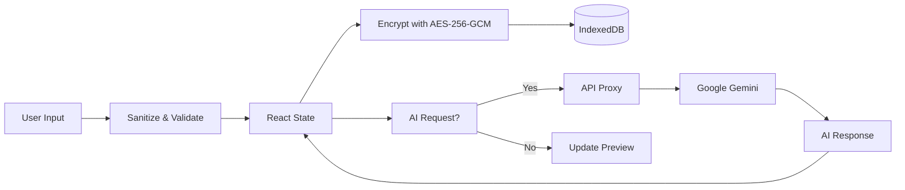

<div align="center">

<br />


<br /><br />

# ✨ AI-Powered Resume Builder

**The Modern, Privacy-First Resume Creation Platform**

*Build professional, ATS-optimized resumes with AI assistance — all without your data ever leaving your device.*

<br />

<!-- Tech Stack Badges -->


<br /><br />

<!-- Security & Storage Badges -->


<br /><br />

[📖 Documentation](#-table-of-contents) · [🚀 Quick Start](#-quick-start) · [✨ Features](#-features) · [🤝 Contributing](#-contributing)

</div>

<br />

---

<br />

## 📖 Table of Contents

- [🎯 Project Overview](#-project-overview)
- [✨ Features](#-features)
- [🛠️ Tech Stack](#️-tech-stack)
- [🏗️ Architecture](#️-architecture)
- [📂 Folder Structure](#-folder-structure)
- [🚀 Quick Start](#-quick-start)
- [⚙️ Configuration](#️-configuration)
- [📘 Usage Guide](#-usage-guide)
- [🔐 Security & Privacy](#-security--privacy)
- [🤝 Contributing](#-contributing)
- [🗺️ Roadmap](#️-roadmap)
- [📄 License](#-license)

<br />

---

<br />

## 🎯 Project Overview

**AI-Powered Resume Builder** is a production-grade, open-source application designed to revolutionize how professionals create and optimize their resumes. Built with cutting-edge web technologies and powered by **Google Gemini AI**, this platform delivers intelligent content suggestions, real-time analysis, and ATS optimization—all while maintaining **complete user privacy** through a local-first architecture.

<br />

### Who Is This For?

| Audience | Benefit |
|:---------|:--------|
| **Job Seekers** | Create professional, ATS-friendly resumes with AI-powered suggestions |
| **Career Changers** | Get tailored recommendations to highlight transferable skills |
| **Students & Graduates** | Build your first resume with guided AI assistance |
| **Privacy-Conscious Users** | Your data stays on your device—never uploaded to external servers |
| **Developers** | Fork, extend, and customize for your own projects |

<br />

### Core Value Proposition

<table>
<tr>
<td align="center" width="33%">
<h3>🛡️ Privacy First</h3>
<p>Your resume data <strong>never leaves your device</strong>. All processing happens in-browser with military-grade encryption.</p>
</td>
<td align="center" width="33%">
<h3>🤖 AI-Native</h3>
<p>Built from the ground up with <strong>Google Gemini AI</strong> to act as your personal career coach and content optimizer.</p>
</td>
<td align="center" width="33%">
<h3>⚡ Modern UX</h3>
<p>A <strong>premium, fluid interface</strong> built with Next.js 16, React 19, and Tailwind CSS 4 for the best experience.</p>
</td>
</tr>
</table>

<br />

---

<br />

## ✨ Features

### 🧠 Advanced AI Capabilities

| Feature | Description |
|:--------|:------------|
| **Smart Summarization** | Generate professional profile summaries based on your experience |
| **Content Rewriting** | Transform bullet points with professional, concise, or detailed tones |
| **Deep Resume Analysis** | Get actionable feedback, scoring, and skill gap analysis |
| **LinkedIn Optimizer** | Analyze LinkedIn profiles to align your resume with your professional brand |
| **ATS Optimization** | Built-in checks to ensure your resume passes automated screening systems |

<br />

### 🛠️ Powerful Builder Tools

| Feature | Description |
|:--------|:------------|
| **Real-Time Preview** | Live WYSIWYG editing with instant visual feedback |
| **Multiple Templates** | Choose from Classic, Modern, and Professional ATS-friendly templates |
| **PDF Export** | High-quality, print-ready document exports |
| **Undo/Redo System** | Full history tracking with keyboard shortcuts (Ctrl+Z / Ctrl+Y) |
| **Zoom Controls** | Adjustable preview scaling for detailed editing |
| **Auto-Save** | Changes are automatically persisted to local storage |

<br />

### 🔒 Enterprise-Grade Security

| Feature | Description |
|:--------|:------------|
| **Local Encryption** | AES-256-GCM encryption for all sensitive data at rest |
| **BYOK (Bring Your Own Key)** | Use your own Gemini API key—we never store or track your usage |
| **Security Headers** | Full CSP, HSTS, X-Frame-Options, and more |
| **Input Sanitization** | XSS protection with comprehensive input validation |

<br />

### 🆓 100% Free & Open Source

- **No premium tiers** — All features are free forever
- **No accounts required** — Start building immediately
- **No data collection** — Zero tracking, zero analytics
- **MIT Licensed** — Fork, modify, and use commercially

<br />

---

<br />

## 🛠️ Tech Stack

This project is built on a modern, bleeding-edge stack optimized for performance, type safety, and developer experience.

<br />

### Frontend

| Technology | Version | Purpose |
|:-----------|:--------|:--------|
| [**Next.js**](https://nextjs.org/) | 16.x | App Router, Server Components, API Routes |
| [**React**](https://react.dev/) | 19.x | UI library with latest concurrent features |
| [**TypeScript**](https://www.typescriptlang.org/) | 5.x | Strict type safety and enhanced DX |
| [**Tailwind CSS**](https://tailwindcss.com/) | 4.x | Utility-first CSS framework |
| [**Framer Motion**](https://www.framer.com/motion/) | 12.x | Smooth animations and transitions |

<br />

### AI & Backend

| Technology | Purpose |
|:-----------|:--------|
| [**Google Gemini**](https://ai.google.dev/) | AI engine (Gemini 2.5 Flash model) |
| [**Next.js API Routes**](https://nextjs.org/docs/app/building-your-application/routing/route-handlers) | Lightweight proxy layer for API requests |
| [**Prisma**](https://www.prisma.io/) | Database toolkit (optional, for hybrid deployments) |

<br />

### Security & Storage

| Technology | Purpose |
|:-----------|:--------|
| [**Web Crypto API**](https://developer.mozilla.org/en-US/docs/Web/API/Web_Crypto_API) | AES-256-GCM encryption, PBKDF2 key derivation |
| [**IndexedDB**](https://developer.mozilla.org/en-US/docs/Web/API/IndexedDB_API) | Primary encrypted data storage |
| [**LocalStorage**](https://developer.mozilla.org/en-US/docs/Web/API/Window/localStorage) | Fallback storage and API key persistence |

<br />

### Development Tools

| Tool | Purpose |
|:-----|:--------|
| [**Biome**](https://biomejs.dev/) | High-performance linter and formatter |
| [**Zod**](https://zod.dev/) | Schema validation for forms and data |
| [**Lucide React**](https://lucide.dev/) | Beautiful, consistent SVG icons |
| [**Bun**](https://bun.sh/) | Fast package manager and runtime |

<br />

---

<br />

## 🏗️ Architecture

The application follows a **Local-First, Client-Centric** architecture designed for maximum privacy, speed, and offline capability.

<br />

### High-Level Design

```
┌─────────────────────────────────────────────────────────────────────────┐
│                           USER'S BROWSER                                 │
│  ┌───────────────────────────────────────────────────────────────────┐  │
│  │                        React Application                           │  │
│  │  ┌─────────────┐  ┌─────────────┐  ┌─────────────────────────┐   │  │
│  │  │   Builder   │  │  AI Tools   │  │    Template Engine      │   │  │
│  │  │    Forms    │  │   Panel     │  │  (Classic/Modern/Pro)   │   │  │
│  │  └──────┬──────┘  └──────┬──────┘  └───────────┬─────────────┘   │  │
│  │         │                │                      │                 │  │
│  │         └────────────────┼──────────────────────┘                 │  │
│  │                          ▼                                        │  │
│  │              ┌─────────────────────┐                              │  │
│  │              │   State Management  │  (React Context + Hooks)     │  │
│  │              └──────────┬──────────┘                              │  │
│  │                         │                                         │  │
│  │         ┌───────────────┼───────────────┐                         │  │
│  │         ▼               ▼               ▼                         │  │
│  │  ┌────────────┐  ┌────────────┐  ┌────────────┐                   │  │
│  │  │ IndexedDB  │  │LocalStorage│  │ Web Crypto │                   │  │
│  │  │ (Resumes)  │  │(API Keys)  │  │(Encryption)│                   │  │
│  │  └────────────┘  └────────────┘  └────────────┘                   │  │
│  └───────────────────────────────────────────────────────────────────┘  │
└─────────────────────────────────────────────────────────────────────────┘
                                    │
                                    │ HTTPS (API Key in Header)
                                    ▼
                    ┌───────────────────────────────┐
                    │  Next.js API Routes (Proxy)   │
                    │  - Rate Limiting              │
                    │  - Request Validation         │
                    │  - No Data Storage            │
                    └───────────────┬───────────────┘
                                    │
                                    ▼
                    ┌───────────────────────────────┐
                    │      Google Gemini API        │
                    │  (AI Processing & Response)   │
                    └───────────────────────────────┘
```

<br />

### Key Architectural Decisions

| Decision | Rationale |
|:---------|:----------|
| **Client-Side Encryption** | All resume data is encrypted before storage using AES-256-GCM via the Web Crypto API |
| **No Backend Database** | Resume data is stored exclusively in the user's browser—eliminates server-side data breach risks |
| **API Proxy Layer** | Next.js routes act as a thin proxy for AI requests, adding rate limiting without storing data |
| **BYOK Model** | Users provide their own Gemini API keys, ensuring we never have access to their credentials |

<br />

### Data Flow



<br />

---

<br />

## 📂 Folder Structure

A clean, modular structure designed for scalability and ease of contribution.

```
📦 resume-builder
├── 📂 app/                      # Next.js App Router
│   ├── 📂 api/                  # API Routes
│   │   ├── 📂 ai/               # AI proxy endpoints (summarize, rewrite, analyze)
│   │   └── 📂 ai-keys/          # API key validation endpoints
│   ├── 📂 builder/              # Resume Builder page (/builder)
│   ├── 📄 page.tsx              # Landing page (/)
│   ├── 📄 layout.tsx            # Root layout with providers
│   └── 📄 globals.css           # Global styles
│
├── 📂 components/               # React Components
│   ├── 📂 ai/                   # AI-related components
│   │   ├── 📄 api-key-settings.tsx    # API key management UI
│   │   ├── 📄 resume-ai-panel.tsx     # AI analysis panel
│   │   ├── 📄 linkedin-analyzer.tsx   # LinkedIn profile analyzer
│   │   └── 📄 content-ai-toolbar.tsx  # Inline AI tools
│   ├── 📂 forms/                # Form input components
│   ├── 📂 landing/              # Landing page sections
│   ├── 📂 templates/            # Resume templates
│   │   ├── 📄 classic-template.tsx      # Single-column classic
│   │   ├── 📄 modern-template.tsx       # Two-column modern
│   │   └── 📄 professional-template.tsx # Professional ATS-friendly
│   └── 📂 ui/                   # Design system components
│
├── 📂 lib/                      # Core Logic & Utilities
│   ├── 📂 client/               # Client-side utilities
│   ├── 📂 security/             # Security utilities
│   │   ├── 📄 input-sanitizer.ts    # XSS protection
│   │   └── 📄 security-headers.ts   # HTTP security headers
│   └── 📂 server/               # Server-side utilities
│
├── 📂 context/                  # React Context providers
├── 📂 hooks/                    # Custom React hooks
├── 📂 types/                    # TypeScript type definitions
├── 📄 .env.example              # Environment template
├── 📄 package.json              # Dependencies
├── 📄 SECURITY.md               # Security documentation
└── 📄 README.md                 # This file
```

<br />

---

<br />

## 🚀 Quick Start

Get up and running in under 5 minutes.

<br />

### Prerequisites

| Requirement | Version | Notes |
|:------------|:--------|:------|
| **Node.js** | 18.x+ | Or use [Bun](https://bun.sh/) (recommended) |
| **Package Manager** | npm, yarn, pnpm, or bun | bun is recommended for speed |
| **Gemini API Key** | — | [Get it free here](https://aistudio.google.com/app/apikey) |

<br />

### Installation

**1. Clone the Repository**

```bash
git clone https://github.com/vijay324/Resume-Flotick.git
cd Resume-Flotick
```

**2. Install Dependencies**

```bash
# Using Bun (recommended)
bun install

# Or using npm
npm install

# Or using yarn
yarn install

# Or using pnpm
pnpm install
```

**3. Configure Environment**

```bash
# Copy the example environment file
cp .env.example .env
```

Edit `.env` with your configuration (see [Configuration](#️-configuration) for details).

**4. Start Development Server**

```bash
# Using Bun
bun dev

# Or using npm
npm run dev
```

**5. Open the Application**

Navigate to [http://localhost:3000](http://localhost:3000) in your browser.

<br />

### Build for Production

```bash
# Build
bun run build
# or: npm run build

# Start production server
bun run start
# or: npm run start
```

<br />

---

<br />

## ⚙️ Configuration

### Environment Variables

Create a `.env` file in the root directory with the following variables:

| Variable | Required | Default | Description |
|:---------|:---------|:--------|:------------|
| `DATABASE_URL` | No | `file:./dev.db` | Database URL (SQLite for local development) |
| `ENCRYPTION_SECRET` | **Yes** | — | Secret key for local data encryption. Generate with: `openssl rand -base64 32` |
| `RATE_LIMIT_REQUESTS_PER_DAY` | No | `50` | Maximum AI requests per user per day |

<br />

### Example `.env` File

```env
# Database connection string (SQLite for local development)
DATABASE_URL="file:./dev.db"

# Encryption secret for local data security
# IMPORTANT: Generate a secure random string and keep it safe!
ENCRYPTION_SECRET="your_super_secure_random_string_here"

# Optional: Rate limiting
RATE_LIMIT_REQUESTS_PER_DAY=50
```

<br />

### API Key Setup

The application uses a **Bring Your Own Key (BYOK)** model for AI features:

1. **Get a Gemini API Key**: Visit [Google AI Studio](https://aistudio.google.com/app/apikey) and create a free API key
2. **Enter Your Key**: In the app, navigate to **AI Tools** section and enter your API key
3. **Secure Storage**: Your key is encrypted with AES-256-GCM and stored only in your browser
4. **Direct Communication**: The key is sent directly to Google's API—our servers never see it

> ⚠️ **Security Note**: Never share your API key. If compromised, regenerate it immediately from [Google AI Studio](https://aistudio.google.com/app/apikey).

<br />

---

<br />

## 📘 Usage Guide

### 🎬 First-Time User Flow

1. **Visit the Landing Page** → Click "Get Started" to enter the Builder
2. **Add Your API Key** (optional) → Navigate to AI Tools and add your Gemini API key for AI features
3. **Fill Out Your Profile** → Enter personal info, experience, education, and skills
4. **Choose a Template** → Select from Classic, Modern, or Professional layouts
5. **Enhance with AI** → Use the ✨ AI buttons to improve your content
6. **Review & Export** → Preview your resume and export as PDF

<br />

### 🧠 Using AI Features

| Feature | How to Access | What It Does |
|:--------|:--------------|:-------------|
| **Summarize** | Click ✨ on profile summary field | Generates a professional summary from your experience |
| **Rewrite** | Click ✨ on any text field | Rewrites content in professional, concise, or detailed tone |
| **Analyze** | Open AI Tools → Resume Analysis | Provides detailed scoring and improvement suggestions |
| **LinkedIn Import** | Open AI Tools → LinkedIn Analyzer | Analyzes your LinkedIn profile for optimization tips |

<br />

### ⌨️ Keyboard Shortcuts

| Shortcut | Action |
|:---------|:-------|
| `Ctrl + Z` / `⌘ + Z` | Undo last change |
| `Ctrl + Y` / `⌘ + Shift + Z` | Redo last change |
| `Ctrl + P` / `⌘ + P` | Print / Export to PDF |

<br />

---

<br />

## 🔐 Security & Privacy

We take security seriously. This project is designed to be **zero-knowledge** regarding your personal data.

<br />

### Data Storage

| Data Type | Storage Location | Encryption | Notes |
|:----------|:-----------------|:-----------|:------|
| Resume Data | IndexedDB (browser) | AES-256-GCM | Never leaves your device |
| API Keys | LocalStorage (browser) | AES-256-GCM | Sent only to Google's API |
| Preferences | LocalStorage (browser) | None | Non-sensitive settings |

<br />

### Encryption Details

```
Algorithm:        AES-256-GCM (Authenticated Encryption)
Key Derivation:   PBKDF2-SHA256, 100,000 iterations
IV:               12 bytes, randomly generated per encryption
Salt:             16 bytes, stored with encrypted data
```

<br />

### Security Headers

All responses include comprehensive security headers:

| Header | Value |
|:-------|:------|
| Content-Security-Policy | Strict CSP preventing XSS |
| X-Content-Type-Options | `nosniff` |
| X-Frame-Options | `DENY` |
| X-XSS-Protection | `1; mode=block` |
| Referrer-Policy | `strict-origin-when-cross-origin` |
| Strict-Transport-Security | `max-age=31536000; includeSubDomains` |

<br />

### What We Don't Do

- ❌ **No tracking or analytics**
- ❌ **No cookies beyond essentials**
- ❌ **No server-side storage of resumes**
- ❌ **No access to your API keys**
- ❌ **No selling or sharing of data**

<br />

### Clearing Your Data

You can clear all stored data at any time:

1. **Browser Settings**: Clear site data for this domain
2. **DevTools**: Application → Storage → Clear Storage
3. **Fresh Start**: Use incognito/private browsing

<br />

> 📖 **For comprehensive security documentation, see [SECURITY.md](./SECURITY.md)**

<br />

---

<br />

## 🤝 Contributing

We warmly welcome contributions from the community! Whether it's a bug fix, new feature, documentation improvement, or feedback—every contribution makes this project better.

<br />

### How to Contribute

1. **Fork the repository**
   ```bash
   git clone https://github.com/vijay324/Resume-Flotick.git
   ```

2. **Create a feature branch**
   ```bash
   git checkout -b feature/amazing-feature
   ```

3. **Make your changes** and ensure code quality
   ```bash
   # Run linter
   bun run lint
   
   # Format code
   bun run format
   ```

4. **Commit with clear messages**
   ```bash
   git commit -m "feat: add amazing feature"
   ```

5. **Push and open a Pull Request**
   ```bash
   git push origin feature/amazing-feature
   ```

<br />

### Code Style Guidelines

| Aspect | Standard |
|:-------|:---------|
| **Linter** | [Biome](https://biomejs.dev/) |
| **Formatting** | Run `bun run format` before committing |
| **Types** | Full TypeScript strict mode |
| **Commits** | Follow [Conventional Commits](https://www.conventionalcommits.org/) |
| **Components** | Functional components with hooks |
| **Naming** | PascalCase for components, camelCase for functions |

<br />

### Pull Request Guidelines

- ✅ **Keep PRs focused** — One feature/fix per PR
- ✅ **Write clear descriptions** — Explain what and why
- ✅ **Update documentation** — If applicable
- ✅ **Ensure lint passes** — Run `bun run lint`
- ✅ **Test your changes** — Manually verify functionality

<br />

### Forking & Extending

This project is MIT licensed—you're free to:

- Fork and modify for personal use
- Create derivative works
- Use in commercial projects
- Distribute your modifications

We only ask that you preserve the license notice and attribution.

<br />

---

<br />

## 🗺️ Roadmap

Planned features and improvements for future releases:

<br />

### 🎯 Near-Term

- [ ] **Multiple Resume Profiles** — Save and switch between different resume versions
- [ ] **Custom Templates** — User-created template designs
- [ ] **Cover Letter Generator** — AI-powered cover letter creation
- [ ] **ATS Score Preview** — Real-time ATS compatibility scoring

<br />

### 🚀 Mid-Term

- [ ] **Cloud Sync (Optional)** — Encrypted cloud backup with user-controlled keys
- [ ] **Resume Comparison** — Compare versions side-by-side
- [ ] **Skills Suggestions** — AI-powered skill recommendations based on job descriptions
- [ ] **Multi-Language Support** — Interface localization

<br />

### 🔮 Long-Term

- [ ] **Job Matching** — Match your resume against job descriptions
- [ ] **Interview Prep** — AI-generated interview questions based on your resume
- [ ] **Portfolio Integration** — Link and showcase projects
- [ ] **Mobile App** — Native iOS and Android applications

<br />

---

<br />

## 📄 License

This project is distributed under the **MIT License**. See the [LICENSE](./LICENSE) file for details.

```
MIT License

Copyright (c) 2026 Vijay

Permission is hereby granted, free of charge, to any person obtaining a copy
of this software and associated documentation files (the "Software"), to deal
in the Software without restriction, including without limitation the rights
to use, copy, modify, merge, publish, distribute, sublicense, and/or sell
copies of the Software, and to permit persons to whom the Software is
furnished to do so, subject to the following conditions:

The above copyright notice and this permission notice shall be included in all
copies or substantial portions of the Software.
```

<br />

---

<br />

<div align="center">

### 🌟 Show Your Support

If this project helped you, please consider giving it a **star** on GitHub!

<br />

[](https://github.com/vijay324/Resume-Flotick)

<br />

**Built with ❤️ by [Vijay](https://github.com/vijay324) and the Open Source Community**

<br />

[⬆ Back to Top](#-ai-powered-resume-builder)

</div>
